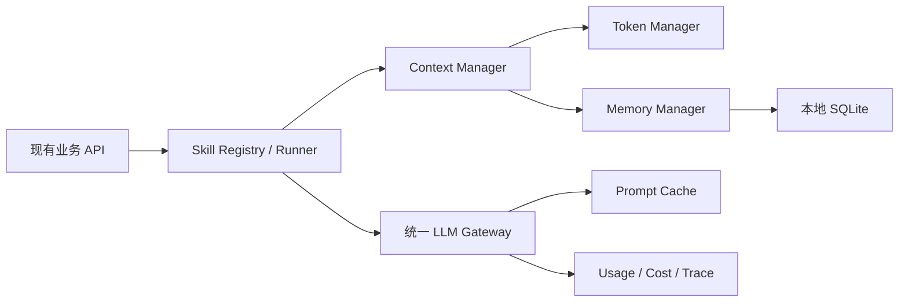

# 阶段二：AI 工程深度建设规划

## 1. 背景与目标

当前项目已经具备多模型适配、简历生成、文本改写、面试准备和模拟面试能力，但模型创建、Prompt、Token 上限及调用日志仍分散在不同业务模块中。

阶段二以“统一 AI Runtime”为主线，建设以下四项能力：

1. 上下文管理系统：统一管理短期记忆、工作记忆、长期记忆和 Token 预算。
2. Skills 系统：将简历、面试、JD 分析等 AI 能力模块化、版本化。
3. Token 优化引擎：通过缓存、增量更新、压缩和智能截断降低消耗。
4. 长期记忆系统：使用本地 SQLite 保存用户偏好、JD 历史和简历版本。

总体原则：新增统一层、保持旧接口、逐步迁移，避免一次性重写现有功能。

## 2. 总体架构



一次标准 AI 调用应依次完成：

1. Skill 选择和输入校验。
2. 加载用户长期记忆。
3. 组装当前任务的工作记忆。
4. 按 Token 预算筛选、压缩和截断上下文。
5. 通过统一 LLM Gateway 调用模型。
6. 记录 Token、延迟、缓存命中和调用结果。
7. 提取值得长期保存的信息。
8. 写入 SQLite 并维护相关历史版本。

建议总周期：6～8 周。

## 3. 目标目录结构

```text
src/libs/ai_engine/
├── __init__.py
├── runtime.py
├── models.py
├── exceptions.py
├── context/
│   ├── manager.py
│   ├── budget.py
│   ├── tokenizer.py
│   ├── extractor.py
│   ├── ranking.py
│   └── compressors.py
├── skills/
│   ├── base.py
│   ├── registry.py
│   ├── runner.py
│   └── builtin/
│       ├── resume_writer/
│       ├── mock_interviewer/
│       ├── interview_coach/
│       ├── text_rewriter/
│       ├── jd_analyzer/
│       ├── skill_matcher/
│       └── career_advisor/
├── memory/
│   ├── manager.py
│   ├── repository.py
│   ├── models.py
│   ├── policies.py
│   └── migrations/
├── optimization/
│   ├── cache.py
│   ├── truncation.py
│   ├── incremental.py
│   └── fingerprints.py
├── providers/
│   ├── gateway.py
│   ├── base.py
│   ├── openai_compatible.py
│   ├── anthropic.py
│   └── ollama.py
└── observability/
    ├── usage.py
    └── tracing.py
```

对应测试目录：

```text
tests/ai_engine/
├── test_context_manager.py
├── test_budget_allocator.py
├── test_compressors.py
├── test_skill_registry.py
├── test_skill_runner.py
├── test_memory_repository.py
├── test_prompt_cache.py
├── test_incremental_context.py
└── integration/
```

## 4. 统一 AI Runtime

AI Runtime 是 Context、Skills、Token 优化和长期记忆的共同入口。

建议调用形式：

```python
result = runtime.execute(
    skill_name="resume_writer",
    inputs={
        "resume": resume_text,
        "job_description": jd_text,
        "language": "zh",
    },
    user_id="local",
    session_id=session_id,
    budget=TokenBudget(total=16000, output=4000),
)
```

统一返回：

```python
SkillResult(
    content=content,
    structured_output=structured_output,
    usage=usage,
    cache_hit=False,
    memories_used=memories_used,
    warnings=warnings,
    trace_id=trace_id,
)
```

职责划分：

- API/Service：业务参数、权限和响应协议。
- Skill：具体 AI 能力和 Prompt。
- Context Manager：决定模型可以看到哪些信息。
- Token Manager：分配各类上下文预算。
- Memory Manager：长期信息的召回和持久化。
- LLM Gateway：屏蔽 Provider 差异并标准化 usage。
- Runtime：编排完整执行流程，不直接承载业务 Prompt。

现有 API 暂不修改，内部逐步转调 Runtime，保证前端和已有功能兼容。

## 5. 上下文管理系统

### 5.1 上下文分类

| 类型 | 生命周期 | 示例 |
|---|---|---|
| 短期记忆 | 当前会话 | 最近几轮模拟面试对话 |
| 工作记忆 | 当前任务 | 本次 JD、目标简历、Skill 中间结果 |
| 长期记忆 | 跨会话 | 求职偏好、写作风格、历史 JD |
| 固定上下文 | Skill 版本周期 | System Prompt、输出格式和规则 |

建议统一数据结构：

```python
ContextItem(
    id="...",
    kind="short_term",
    content="...",
    source="conversation",
    priority=80,
    relevance=0.92,
    token_count=430,
    created_at=created_at,
    expires_at=None,
    metadata={},
)
```

### 5.2 上下文组装流程

```text
收集候选上下文
→ 去重
→ 敏感信息过滤
→ 相关性评分
→ 优先级排序
→ Token 预算分配
→ 压缩或截断
→ 生成最终 messages
```

推荐排序公式：

```text
score = relevance × 0.45
      + explicit_priority × 0.25
      + recency × 0.15
      + source_reliability × 0.15
```

第一版使用关键词、标签、时间和业务字段匹配。待记忆规模增长后，再评估 SQLite FTS5 或本地 embedding。

### 5.3 压缩策略

按成本由低到高实施：

1. `NoCompression`：预算足够时保持原文。
2. `DeduplicateCompression`：删除重复 JD、履历段落和重复消息。
3. `RuleBasedCompression`：移除格式噪声、冗长说明和低价值字段。
4. `ExtractiveCompression`：保留与当前任务最相关的原句。
5. `StructuredCompression`：把长文本转换成字段化摘要。
6. `LLMSummaryCompression`：仍超预算时才调用低成本模型压缩。

约束：

- 简历事实、数字、公司名、时间和技能不得因压缩而改变。
- System Prompt 和输出 Schema 不允许被普通截断。
- 最近用户输入优先于旧对话。
- 压缩结果保留来源和版本，避免反复摘要造成失真。

### 5.4 Token 预算分配

```python
TokenBudget(
    model_context_limit=32000,
    reserved_output=4000,
    reserved_system=2000,
    safety_margin=1000,
    available_input=25000,
)
```

默认比例：

| 区域 | 默认比例 |
|---|---:|
| System Prompt 与输出协议 | 10% |
| 当前用户请求 | 10% |
| 当前任务输入 | 35% |
| 工作记忆 | 20% |
| 长期记忆 | 15% |
| 对话历史 | 10% |

每个 Skill 可覆盖默认比例。例如 `resume_writer` 优先分配给简历和 JD，`mock_interviewer` 优先保留最近对话，`career_advisor` 增加长期记忆预算。

### 5.5 关键信息提取

第一版重点提取：

- 用户硬性求职条件、目标岗位、城市、薪资和行业。
- 明确拒绝项。
- 简历语言和风格偏好。
- JD 核心技能、年限、职责和加分项。
- 用户确认过的事实。
- 简历版本变化及修改理由。

保存规则：

- 用户明确表达的内容可以自动保存。
- 模型推断内容必须携带 `confidence`，默认不作为硬偏好。
- 敏感个人信息默认不进入长期记忆。
- 临时任务参数不保存或设置过期时间。

## 6. Skills 系统

### 6.1 Skill 规范

```text
skill_name/
├── skill.py
├── metadata.yaml
├── prompts/
│   ├── system_zh.md
│   ├── system_en.md
│   └── user.md
├── examples/
│   ├── basic.yaml
│   └── edge_cases.yaml
├── schemas.py
└── tests/
```

`metadata.yaml` 示例：

```yaml
name: jd_analyzer
version: 1.0.0
description: 提取并分析职位描述
input_schema: JDAnalyzerInput
output_schema: JDAnalysis
default_model_tier: balanced
token_budget:
  total: 8000
  output: 1500
memory:
  read:
    - job_preferences
  write:
    - job_descriptions
tools: []
tags:
  - job
  - analysis
```

统一协议：

```python
class Skill(Protocol):
    metadata: SkillMetadata

    def build_context(self, request, memory) -> ContextRequest: ...
    def build_messages(self, context) -> list[Message]: ...
    def parse_output(self, response) -> SkillResult: ...
    def validate_output(self, result) -> None: ...
```

### 6.2 内置 Skills

| Skill | 输入 | 输出 | 记忆策略 |
|---|---|---|---|
| `resume_writer` | 简历、JD、语言、模板 | 结构化简历或修改结果 | 读取风格偏好，写入版本历史 |
| `mock_interviewer` | 简历、JD、面试类型、历史消息 | 下一问题、状态、最终评估 | 保存会话摘要和能力弱项 |
| `interview_coach` | 简历、JD、目标类型 | 准备计划、问题、回答建议 | 读取历史弱项 |
| `text_rewriter` | 文本、模式、语言、上下文 | 改写文本、变化说明 | 可选读取写作风格 |
| `jd_analyzer` | JD 原文 | 结构化 JD 分析 | 归档 JD 和分析版本 |
| `skill_matcher` | 简历、JD 分析 | 匹配度、证据、差距 | 不把推断保存为用户事实 |
| `career_advisor` | 偏好、经历、历史 JD | 职业建议、行动计划 | 深度读取长期记忆 |

### 6.3 工具权限

Tools 使用白名单：

```python
ToolSpec(
    name="load_resume",
    permission="read",
    timeout_seconds=3,
    cacheable=True,
)
```

第一阶段可提供：

- `load_resume`
- `load_job_preferences`
- `search_job_history`
- `save_resume_version`
- `calculate_skill_match`
- `load_interview_history`

所有写操作必须通过 Repository，不允许 Skill 直接执行 SQL。

### 6.4 现有能力迁移

| 当前实现 | 目标 Skill |
|---|---|
| `backend/services/resume_service.py::rewrite_text` | `text_rewriter` |
| `LLMResumer` 和定制简历流程 | `resume_writer` |
| `InterviewPrepGenerator` | `interview_coach` |
| `MockInterviewer` | `mock_interviewer` |
| `LLMParser` 和 JD 摘要逻辑 | `jd_analyzer` |
| 新增能力 | `skill_matcher` |
| 新增能力 | `career_advisor` |

推荐迁移顺序：

1. `text_rewriter`
2. `jd_analyzer`
3. `interview_coach`
4. `mock_interviewer`
5. `resume_writer`
6. `skill_matcher`
7. `career_advisor`

## 7. Token 优化引擎

### 7.1 Prompt caching

建立两级缓存：

- L1：进程内 LRU，处理短期重复请求。
- L2：SQLite 持久缓存，应用重启后仍可命中。

缓存键应包含：Provider、模型、模型参数、Skill 名称和版本、标准化 Prompt、标准化输入、上下文 fingerprint、输出 Schema 版本。

缓存键不包含 trace ID、时间戳和无业务意义的临时 metadata。API Key 永远不能进入缓存或日志。包含敏感信息的 Skill 可设置 `cacheable: false`。

### 7.2 增量更新

重点场景：

- JD 未变化，只修改简历某一部分。
- 简历未变化，只切换输出风格。
- 模拟面试仅增加一轮对话。
- 同一 JD 重新计算匹配度。

为大文档和语义分区生成 fingerprint：

```text
document_hash
section_hashes
changed_sections
derived_artifact_version
```

仅重算被修改部分及其依赖结果。

### 7.3 智能截断

截断必须基于语义块：

- 简历按 section 和经历条目。
- JD 按职责、要求和加分项。
- 对话按完整消息轮次。
- Markdown 按标题和段落。
- YAML/JSON 按完整字段。

处理顺序：去重、删除低相关历史、压缩旧对话、压缩低优先级文档，最后才截断正文。输出格式约束和关键事实清单不可截断。

### 7.4 Token 观测

每次调用记录：

- Skill、版本、模型和 Provider。
- Prompt、Completion 和 Total Tokens。
- 各上下文分区 Token 数。
- 压缩前后 Token 数。
- 缓存命中状态。
- 延迟和重试次数。
- 估算成本。
- 输出校验状态。

现有 `open_ai_calls.json` 日志逐步替换为 Provider-neutral usage event，同时保留兼容导出。

### 7.5 优化目标

- 重复调用缓存命中率不低于 80%。
- 模拟面试第 10 轮输入 Token 不随历史无限线性增长。
- 长 JD 与长简历场景输入 Token 降低 25%～40%。
- 关键事实保留率不低于 98%。
- 结构化输出成功率不低于优化前基线。

## 8. 长期记忆系统

### 8.1 存储方式

默认数据库位置：

```text
data_folder/ai_memory.sqlite3
```

数据库文件加入 `.gitignore`，允许通过配置覆盖路径。启用 WAL、外键约束、Busy Timeout 和 Schema Migration。

系统默认单用户 `user_id="local"`，数据模型保留多用户字段。

### 8.2 数据表

核心表：

```text
users
memory_items
memory_events
job_descriptions
resume_versions
interview_sessions
interview_messages
skill_runs
prompt_cache
schema_migrations
```

`memory_items`：

```text
id, user_id, namespace, key, value_json, source, confidence,
importance, status, created_at, updated_at, expires_at, content_hash
```

Namespace：

- `job_preferences`
- `resume_style`
- `career_goals`
- `interview_weaknesses`
- `communication_preferences`

`job_descriptions`：

```text
id, user_id, company, role, raw_text, normalized_json,
source_url, content_hash, status, created_at, last_used_at
```

`resume_versions`：

```text
id, user_id, parent_version_id, language, content, content_hash,
change_summary, source_skill_run_id, created_at
```

简历版本第一阶段保存完整快照，确保恢复可靠；diff 仅作为后续可选优化。

`skill_runs`：

```text
id, skill_name, skill_version, user_id, session_id, input_hash,
model, usage_json, cache_hit, status, error_code, started_at, finished_at
```

### 8.3 记忆写入与冲突

```text
候选记忆提取
→ 规则与置信度过滤
→ 合并、覆盖或新增
```

支持 `ADD`、`UPDATE`、`SUPERSEDE`、`DELETE` 和 `EXPIRE`。

冲突规则：

- 最近的用户明确表达优先。
- 明确表达优于模型推断。
- 不静默覆盖互相冲突的硬性偏好。
- 冲突项保留历史事件，必要时要求用户确认。

### 8.4 隐私功能

必须提供：

- 查看已保存记忆。
- 按类别或单条删除。
- 清空全部记忆。
- 导出 JSON。
- 禁用长期记忆。
- 禁用 Prompt/响应缓存。
- 敏感字段脱敏。
- 日志不记录 API Key 和完整 secrets。

建议 API：

```text
GET    /api/memory
POST   /api/memory
PATCH  /api/memory/{id}
DELETE /api/memory/{id}
DELETE /api/memory
GET    /api/memory/export
GET    /api/resume/versions
POST   /api/resume/versions/{id}/restore
GET    /api/jobs/history
```

## 9. 实施里程碑

### M0：基线与设计冻结（2～3 天）

- 统计现有 AI 调用入口。
- 建立代表性输入样本。
- 测量 Token、延迟、质量和失败率。
- 确定 Skill、Context、Memory 核心协议。
- 确定数据保留和隐私策略。

交付：架构决策记录、基准数据集、Schema 草案和迁移清单。

### M1：统一 LLM Gateway（约 1 周）

- 标准化 OpenAI-compatible、Anthropic、Ollama 调用。
- 统一 `max_output_tokens`、temperature、usage 和错误。
- 建立统一 trace 与 Token 日志。
- 保留现有模型配置兼容层。

验收：三种 Provider 完成 mock 测试；调用方不再解析 Provider-specific usage；API Key 不进入日志；重试有明确上限。

### M2：Context Manager 与 Token Budget（约 1～1.5 周）

- 实现上下文数据模型、Token 估算器和预算分配器。
- 实现去重、规则压缩和智能截断。
- 输出上下文决策报告。

验收：输入不超过模型上下文限制；关键事实不因截断丢失；可解释各部分 Token 分配和丢弃原因。

### M3：Skill Framework（约 1 周）

- 实现 metadata、registry、runner、Prompt 版本和 Tool 白名单。
- 使用 Pydantic 校验输入输出。
- 迁移 `text_rewriter` 和 `jd_analyzer`。

验收：Skill 可注册、发现、执行和禁用；未授权工具无法调用；原文本改写 API 保持兼容。

### M4：SQLite 长期记忆（约 1～1.5 周）

- 实现 Repository、Migration 和核心数据表。
- 实现偏好、JD、简历版本和 Skill Run 存储。
- 实现记忆提取、冲突策略、CRUD、导出和清空 API。
- 前端增加基础记忆管理入口。

验收：重启后数据保留；支持删除和导出；简历版本可恢复；重复 JD 可去重；禁用记忆后不发生持久化写入。

### M5：Token 优化（约 1 周）

- 实现 L1/L2 Prompt Cache。
- 实现文档和 Section Fingerprint。
- 实现增量上下文和缓存失效策略。
- 建立 Token 优化报表。

验收：Skill、Prompt 或 Schema 版本变化会使缓存失效；重复请求正确命中；局部修改仅更新相关派生结果；Token 降低且质量不退化。

### M6：迁移剩余 Skills（约 1～1.5 周）

依次迁移：

1. `interview_coach`
2. `mock_interviewer`
3. `resume_writer`
4. `skill_matcher`
5. `career_advisor`

验收：现有 API 和前端流程继续可用；所有新 AI 调用经过 Runtime；各 Skill 具备独立预算、Prompt 版本和测试样例。

## 10. 测试策略

### 10.1 单元测试

- 预算计算和安全边界。
- 上下文排序、去重和压缩。
- SQLite CRUD 和 Migration。
- 记忆冲突处理。
- 缓存键稳定性。
- Skill 输入输出校验。
- 敏感信息过滤。

### 10.2 集成测试

- `API → Skill → Context → Gateway`。
- `Skill → Memory read/write`。
- Provider usage 标准化。
- 缓存命中和失效。
- 简历版本恢复。
- 模拟面试多轮会话。

CI 默认使用 Fake LLM，不调用真实付费 API。

### 10.3 回归数据集

- 中英文简历各 5～10 份。
- 不同长度 JD 20 份。
- 模拟面试对话脚本 5 组。
- 文本改写样本 30 组。
- 极长输入和格式异常样本。

评估事实一致性、格式合法性、JD 覆盖率、技能匹配证据、Token 使用、响应时间和缓存效果。

## 11. 风险与应对

| 风险 | 应对措施 |
|---|---|
| 一次性重构破坏现有功能 | 保留旧 Service/API，通过适配器逐个迁移 |
| 摘要造成简历事实失真 | 锁定关键事实，采用结构化压缩并增加事实回归测试 |
| 模型 Tokenizer 不一致 | 精确 Tokenizer、保守估算和 Safety Margin |
| 缓存返回过时内容 | 缓存键包含 Skill、Prompt、Schema 和上下文版本 |
| 长期记忆污染 | 区分明确事实与模型推断，保存 confidence 和 source |
| SQLite 并发写锁 | WAL、短事务和 Repository 层写入管理 |
| 隐私数据进入日志 | 统一脱敏，默认不保存完整 Prompt |
| Provider 差异持续外泄 | 所有差异封装在 Gateway，不暴露给 Skill |
| Token 降低但质量下降 | 优化前建立基线并设置事实保留和质量门槛 |

## 12. 完成定义

阶段二同时满足以下条件时视为完成：

- 所有主要 AI 能力均可通过 Skill Registry 执行。
- 现有简历、改写和面试 API 保持兼容。
- 每次调用都有明确 Token 预算且不会溢出上下文窗口。
- 长对话不会导致输入 Token 无限制线性增长。
- 用户偏好、历史 JD 和简历版本可持久化、查看、导出和删除。
- Prompt Cache 具备正确的命中与失效机制。
- Skill Prompt、Tools、Examples、Budget 和 Metadata 均实现版本管理。
- 回归样本关键事实保留率达到 98% 以上。
- Token 消耗相较基线下降至少 25%，质量无明显退化。
- CI 使用 Fake LLM 完成核心测试，不依赖外部 API。

## 13. 推荐的首个开发批次

首个批次按以下顺序实施：

```text
LLM Gateway
→ Context 核心数据模型
→ TokenBudgetAllocator
→ text_rewriter Skill
```

这条路径能够用改动范围较小的文本改写能力验证整套架构，同时暂时避开简历生成和模拟面试中更复杂的调用链。
